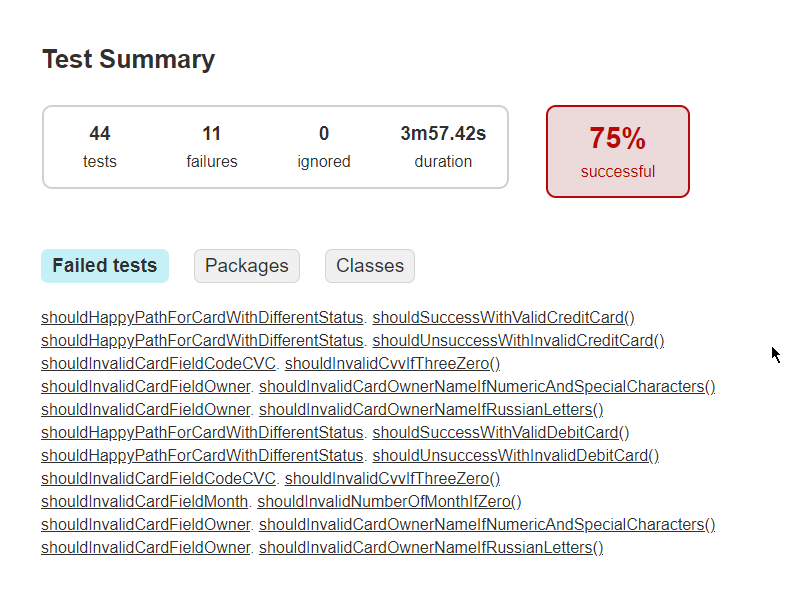
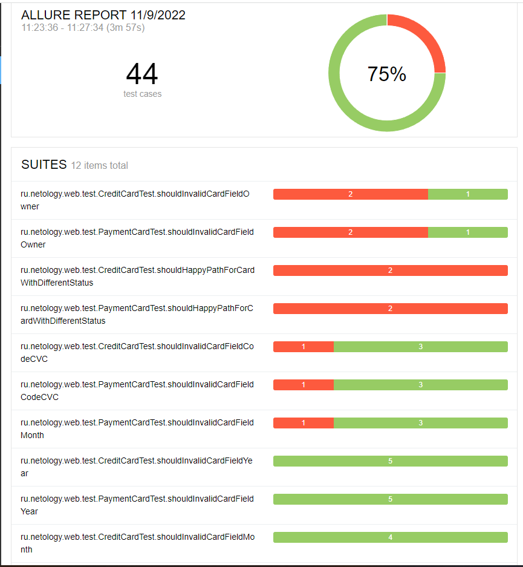
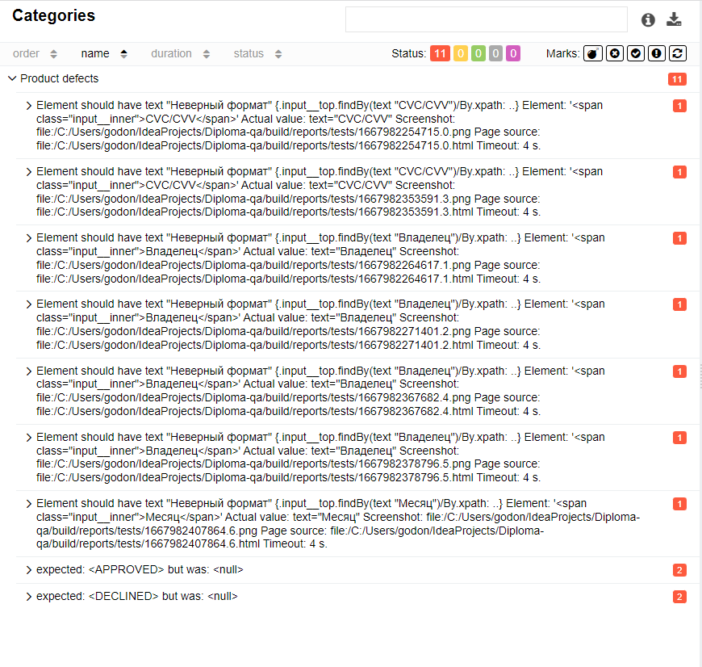
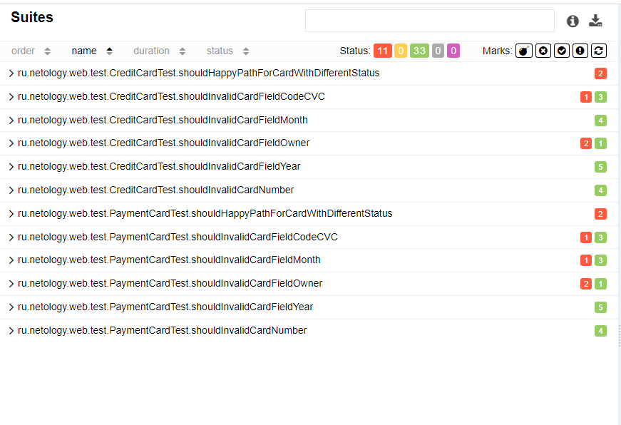

**Отчётные документы по итогам тестирования.**

В рамках дипломного проекта была проведена автоматизация тестирования комплексного сервиса, взаимодействующего с СУБД и API Банка.

Общее количество тест-кейсов для каждой СУБД- 44 шт. Из них:

успешных - 33 тест-кейса
неуспешных - 11 тест-кейсов.
Отчёт Gradle

Отчёт Allure

Всего успешно прошли 75% тестов. В результате составлены баг-репорты, представленные в Issues

https://github.com/GodIrina/Diploma-qa/issues

Общие рекомендации.

Приложение к выпуску не готово, так как найдены критические ошибки, которые негативно скажутся на бизнесе. Необходима доработка веб приложения, поэтому необходимо:

- Исправить дефекты, связанные с неверными сообщениями об ошибках
- Исправить сообщение об успешности покупки в случае отклонения операции покупки